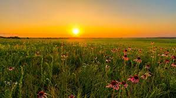
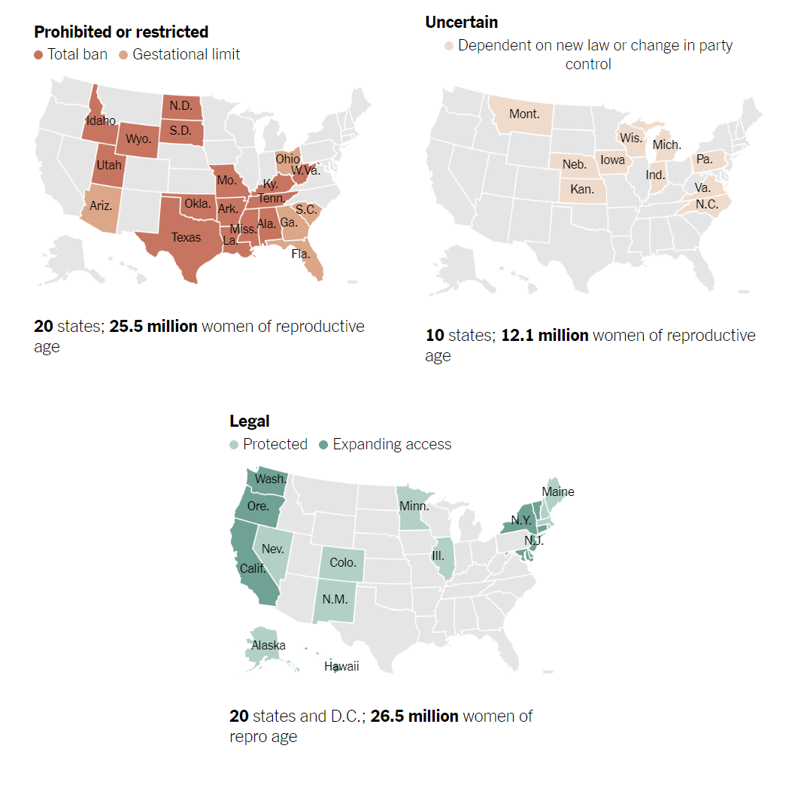

# Operation: Find Us A Home!
This project is log of the research Ricky and Sami are doing to find a safe and happy home for themselves and their future family. Their research takes into account environmental, professional, and legislative landscape for two queer women of color working as an academic and a doctor. 

This site is also a bit of practice for Ricky who is learning and practicing coding! Ideally this log will also show the evolution of Ricky's coding journey and skills.
Each week Sam chooses a place that seems appealing, and Ricky does a bit of research about the place according to the parameters required.

# Request No. 1 - "Prairie"

This request from Sami likely is driven at least partly by her mother's deep affection for Little House On the Prairie. If we do end up in the prairie, I hope we'll find much more luck than the Ingalls family.

> Sami thinks it's important to note that while the Ingalls family had some hard times, they did have some good luck. Sami did immediately bring up that Mary went blind... ... BUT she does think that an argument can be made that there were some important anti-ableist narratives as Mary was able to find happiness and make her own life despite any limitations that might have been imposed upon her by others.

Generally, the prairie in the United States includes part or all of: Ohio, Illinois, Minnesota, Iowa, Missouri, North Dakota, South Dakota, Nebraska, Kansas, Oklahoma, Texas, Montana, Wyoming, Colorado, and New Mexico. The eastern-most prairie is made up mostly 

## Initial Impressions

##### Immediate pros for the prairie:
- the Ingalls lived in Minnesota!
- Sami and Ricky have always liked the idea of having a farm and Ricky would thrive in a subsitence landscape
- Ricky has been really interested in Minneapolis as a place for ethnic American theatre as of late, so being close to Twin Cities could be great
- Colorado is a great place to practice queer health

##### Immediate cons for the prairie:
- the prairie is almost entirely red states which doesn't necessarily mean the states are our of the question, but safety will of course be an important consideration.

## Research 

### Political Landscape

One of Ricky's biggest concerns when looking at any place to live or settle is legislation. With the impending overturning or Roe v. Wade, and the relative inability to effect change in a place where Ricky and Sam do not currently live, it seems important to look towards the likelihood of legislative change and/or the ability to realistically fight for protections. While Sami and Ricky are queer and don't anticipate needing abortions for their own survival, restrictive abortion access can be a harbinger for restrictions of all kinds on the bodies and lives of minoritized and oppressed peoples. 

Beccause of the above, [the New York Times' interactive map](https://www.nytimes.com/interactive/2022/us/abortion-laws-roe-v-wade.html) showing the legal status of abortion without Roe will be instrumental.

On 6/22/22 SCOTUS announced they'll be releasing the decision about Dobbs v. Jackson Women's Health Organization on Friday 6/24/22. Ricky and Sami are both praying for an outcome that will mean they don't have to be so restrictive of their search but preparing for the expected worst. The initial leak of the draft decision is indeed what triggered the journey cataloged on this page.
 
On 6/24/22 SCOTUS overturned not only Roe v. Wade, but also Casey v. Planned Parenthood with at least one justice encouraging that cases should be brought forward so that Griswold, Lawrence, and Obergefell which protect access to contraceptives, freedom from criminal punishment for participating in gay sex, and the right to gay marriage might also be overturned.

At the time of the decision, approximately 13 states had some type of trigger law in effect to make abortion illegal within 30 days including Kentucky, Tennessee, Mississippi, Missouri, Arkansas, Louisiana, Oklahoma, Texas, North Dakota, South Dakota, Wyoming, Idaho, Utah.

## Next steps

To give us a smaller starting point then, the choices for what Ricky might consider "workable or ideal" is Illinois, Minnesota, Iowa, Nebraska, Kansas, Montana, Colorado, and New Mexico. Still a sizeable list.

On the list of states with strong legal protections are Minnesota, Illinois, Colorado, and New Mexico.

On the list of states which would require good grassroots organizing are Iowa, Nebraska, Kansas, and Montana?

##### Questions for Sami at this point:

- Are there any states that jump right out immediately?
*Answer*: Minnesota, Colorado, New Mexico

- How do you feel about potentially dealing with tornadoes?
*Answer*: fine with it as long as we have a place meant to deal with tornadoes - probably not too keen on a highrise. Sami has an instinctive ability to live with natural disaster having grown up in New Orleans

- Are there family medicine programs in any of these states that seem particularly interesting?
*Answer*: There are a couple of really cool queer women working with the Indian Health Service. Sami looked up their info and one of them even started the Gallup Indian Health Service Trans Clinic! 

##### Questions/Comments That Sami Has

- Are there Spanish-speaking folk throughout New Mexico? Because Sami doesn't speak Spanish, she is pretty concerned about making sure that she is able to communicate well with her patient popualtion.

The Gallup Indian Health Center is a 99-bed small hospital on the border of the Navajo Reservation. So what parts of NM count as prairie? Both Sami and Ricky would really miss trees and Sami's only recollection of NM was while confronting its flat orangeness on a roadtrip to the Grand Canyon during her early college years.

The bad news is that the Navajo Land Trust is about as far as it could be from the New Mexico prairielands while still being in the same state. But both Sami and Ricky feel that this was still super useful in considering what it might be like to work in New Mexico and brought Sami some thoughts to mull over about working for the Indian Health Service. 